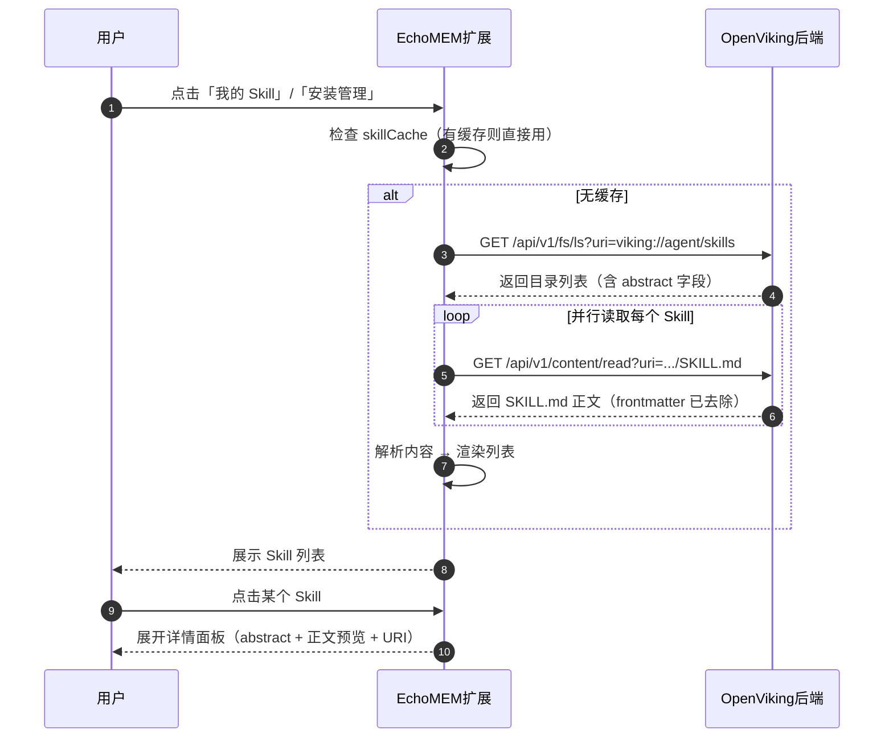

# Skill 列表与详情查看功能 —— 代码实现逻辑文档

> 文档版本：V1（对应 proposals/2026-05-26-skill-list-reading.md）
> 更新日期：2026-05-27

---

## 一、项目概述

| 项目 | 路径 | 角色 |
|------|------|------|
| EchoMEM Web Extension | `EchoMEM-WEB-EXTENSION/` | Chrome 扩展前端（Manifest V3） |
| OpenViking | `OpenViking/` | AI 资源处理后端 |

**核心目标**：将 EchoMEM 扩展「Skill 商店」面板中的「我的 Skill」和「安装管理」区域从静态占位 UI 改造为真实数据驱动，支持从 OpenViking 加载 Skill 列表并查看详情。

---

## 二、时序图



---

## 三、前端修改

### 3.1 修改文件列表

| 文件 | 修改类型 | 说明 |
|------|---------|------|
| `src/utils/skill-parser.js` | 新建 | YAML frontmatter 解析工具 |
| `src/panels/skill-store/index.js` | 重写列表区域 | 替换静态占位 UI，实现真实数据加载与展示 |
| `src/panels/index.js` | 新增导出 | 导出 `initSkillUploadPanel`、`initSkillHistoryPanel`、`initSkillManagePanel` |
| `src/core/router.js` | 新增调用 | `navigateToSkillSection` 中绑定面板初始化函数 |

### 3.2 各文件详细修改

#### `src/utils/skill-parser.js`

```javascript
const FRONTMATTER_PATTERN = /^---\s*\n(.*?)\n---\s*\n(.*)$/s;

export function parseSkillMd(content) {
  const cleanContent = content.replace(/^\uFEFF/, '');
  const match = cleanContent.match(FRONTMATTER_PATTERN);
  if (!match) {
    return { frontmatter: {}, body: cleanContent };
  }
  let frontmatter = {};
  try {
    frontmatter = parseSimpleYaml(match[1]);
  } catch (err) {
    console.warn('Failed to parse skill frontmatter:', err);
  }
  return { frontmatter, body: match[2] };
}

export function getEntryName(entry) {
  if (entry?.name) return entry.name;
  if (entry?.uri) {
    const parts = entry.uri.split('/').filter(Boolean);
    return parts[parts.length - 1] || '未命名';
  }
  return '未命名';
}
```

**关键设计决策**：
- 不引入 `js-yaml` 依赖，使用简单的键值对解析减少包体积
- 去除 UTF-8 BOM 头避免正则匹配失败
- `getEntryName` 从 `uri` 安全提取目录名（因为 `fsLs` `output='agent'` 返回的条目不含 `name` 字段）

---

#### `src/panels/skill-store/index.js`（列表区域）

**核心加载函数 `loadSkills()`**：

```javascript
const SKILL_ROOT_URI = 'viking://agent/skills';

async function loadSkills() {
  if (skillCache) { /* 使用缓存 */ return; }

  const config = await getOpenVikingConfig();
  const client = createClient(config);

  // 1. 列出 Skill 目录
  const lsResult = await client.fsLs(SKILL_ROOT_URI, {
    output: 'agent',
    absLimit: 128,
    showAllHidden: false,
  });
  let entries = Array.isArray(lsResult) ? lsResult : (lsResult?.entries || []);
  entries = entries.filter(e => e.isDir || e.stat?.isDir);

  // 2. 并行读取每个 Skill 的 SKILL.md
  const skills = await Promise.all(
    entries.map(async (entry) => {
      const dirName = getEntryName(entry);
      const baseUri = entry.uri.replace(/\/$/, '');
      const skillUri = `${baseUri}/SKILL.md`;
      const readResult = await client.contentRead(skillUri);
      const content = typeof readResult === 'string'
        ? readResult
        : (readResult?.content || '');

      return {
        name: dirName,
        dirName,
        description: entry.abstract || '',
        uri: baseUri,
        rawContent: content.slice(0, 1000),
        modifiedAt: entry.modTime || entry.mtime || entry.modifiedAt,
      };
    })
  );

  // 3. 按修改时间倒序排列
  skills.sort((a, b) => {
    const ta = a.modifiedAt ? new Date(a.modifiedAt).getTime() : 0;
    const tb = b.modifiedAt ? new Date(b.modifiedAt).getTime() : 0;
    return tb - ta;
  });

  skillCache = skills;
  renderSkills(skills);
}
```

**关键适配点**：OpenViking 处理上传后，写入 VikingFS 的 `SKILL.md` 已去除 frontmatter，只剩 Markdown 正文。因此列表中的 `description` 不再从 `SKILL.md` 解析，而是直接从 `fsLs` 返回的 `entry.abstract` 字段读取（后端在 `output='agent'` 时已提取 frontmatter 的 description 作为 abstract）。

---

## 四、OpenViking 后端行为（复用现有接口，未修改）

### 4.1 接口清单

| 接口路径 | 方法 | 用途 | 调用位置 |
|---------|------|------|---------|
| `/api/v1/fs/ls` | GET | 列出 Skill 目录下的子目录 | `fsLs()` |
| `/api/v1/content/read` | GET | 读取 SKILL.md 正文 | `contentRead()` |

### 4.2 `fsLs` 返回格式（`output='agent'`）

```javascript
[
  {
    uri: 'viking://agent/skills/简单问候助手',
    size: 160,
    isDir: true,
    modTime: '12:43:16',
    abstract: '一个友好的问候助手，会根据时间给出不同的问候语'
  }
]
```

**注意**：`output='agent'` 时返回的条目**不含 `name` 字段**，但有 `uri` 和 `abstract` 字段。`abstract` 是后端从 SKILL.md 的 frontmatter 中提取的 `description`。

### 4.3 `contentRead` 返回格式

`GET /api/v1/content/read?uri=.../SKILL.md` 返回的是处理后的 `SKILL.md` 内容：

```markdown
# 简单问候助手

## 用途

根据当前时间，给出最合适的问候语。
...
```

**注意**：返回的内容**已去除 frontmatter**。前端不能再从中解析 `name` 和 `description`，必须从 `fsLs` 的目录结构和 `abstract` 字段获取元信息。

### 4.4 Skill 存储结构

```
viking://agent/skills/{skill_name}/
├── SKILL.md          ← Markdown 正文（frontmatter 已去除）
├── .abstract.md      ← 隐藏文件：description
└── .overview.md      ← 隐藏文件：VLM 生成的概述
```

---

## 五、整体数据流

```
┌─────────────────────────────────────────────────────────────┐
│                    用户操作（EchoMEM 扩展）                   │
└─────────────────────────────────────────────────────────────┘
    │
    ▼
点击「我的 Skill」/「安装管理」
    │
    ▼
┌─────────────────────────────────────────────────────────────┐
│  1. 检查 skillCache                                           │
│     - 有缓存：直接渲染                                        │
│     - 无缓存：进入加载流程                                    │
└─────────────────────────────────────────────────────────────┘
    │
    ▼
┌─────────────────────────────────────────────────────────────┐
│  2. fsLs(SKILL_ROOT_URI, {output: 'agent'})                  │
│     ──GET /api/v1/fs/ls──▶ OpenViking                        │
│     返回目录列表（含 abstract 字段）                          │
└─────────────────────────────────────────────────────────────┘
    │
    ▼
┌─────────────────────────────────────────────────────────────┐
│  3. 并行读取每个 Skill 的 SKILL.md                            │
│     ──GET /api/v1/content/read──▶ OpenViking                 │
│     返回正文（frontmatter 已去除）                            │
└─────────────────────────────────────────────────────────────┘
    │
    ▼
┌─────────────────────────────────────────────────────────────┐
│  4. 渲染列表                                                  │
│     - name: 从 uri 提取目录名                                 │
│     - description: entry.abstract                             │
│     - 按 modifiedAt 倒序排列                                  │
└─────────────────────────────────────────────────────────────┘
    │
    ▼
用户点击某个 Skill
    │
    ▼
展开详情面板（abstract + 正文预览 + URI）
```

---

## 六、UI 交互细节

### 6.1 列表页面布局

- **搜索框**：顶部，支持按名称和描述实时过滤（300ms debounce）
- **刷新按钮**：搜索框右侧，点击清除缓存并重新加载
- **Skill 卡片**：纵向排列，显示名称、描述摘要、更新时间
- **展开详情**：点击卡片后展开，显示 `abstract`（蓝色提示框）+ 正文预览（灰色代码块）+ VikingURI

### 6.2 「我的 Skill」与「安装管理」的区别

| 页面 | 功能差异 |
|------|---------|
| 我的 Skill | 只读查看，无删除按钮 |
| 安装管理 | 列表项右上角直接显示「删除」按钮，点击后 `openCenterOverlay` 自定义浮层确认 → `fsRm(uri, true)` → 刷新列表 |

---

## 七、错误处理

| 错误场景 | 处理方式 |
|---------|---------|
| `fsLs` 失败（网络/服务端错误） | Toast 提示「加载 Skill 列表失败」，显示空状态 |
| 某个 Skill 的 `SKILL.md` 读取失败 | 跳过该 Skill，`console.warn` 记录，其余正常展示 |
| Skill 目录为空 | 显示空状态提示「暂无 Skill，请先上传」 |
| 删除失败 | `openCenterOverlay` 关闭后 Toast 提示错误，恢复按钮状态 |

---

## 八、性能优化

| 优化点 | 实现方式 |
|--------|---------|
| 并行读取 | `Promise.all` 并行读取所有 Skill 的 `SKILL.md` |
| 内存缓存 | `skillCache` 缓存列表和解析结果，切换面板时优先使用 |
| 手动刷新 | 点击「刷新」按钮时清空 `skillCache` 并重新加载 |
| 搜索节流 | 搜索输入框使用 300ms debounce，避免频繁过滤渲染 |
| 正文截断 | 详情面板中 Markdown 正文只渲染前 1000 字符 |

---

## 九、验收标准对应

| 编号 | 验收项 | 实现方式 |
|------|--------|---------|
| 1 | 「我的 Skill」页面能正确展示真实 Skill 列表 | `fsLs` + `contentRead` + `getEntryName` |
| 2 | 列表按更新时间倒序排列 | `Array.prototype.sort` 按 `modTime` |
| 3 | 每个 Skill 卡片显示名称、描述、更新时间 | `name` 从 uri 提取，`description` 从 `abstract` 读取 |
| 4 | 点击 Skill 展开详情面板 | 点击事件切换 `display` 属性，旋转箭头图标 |
| 5 | 搜索框支持实时过滤 | `input` 事件 + 300ms debounce + `filterSkills()` |
| 6 | Skill 目录为空时显示友好空状态 | `renderSkills([])` 渲染空状态 HTML |
| 7 | 列表加载失败时给出明确错误提示 | `try/catch` + Toast + 错误状态 HTML |
| 8 | 单个 Skill 读取失败不影响其他 Skill | `Promise.all` + 单个 `catch` 返回 `error: true` 后过滤 |
