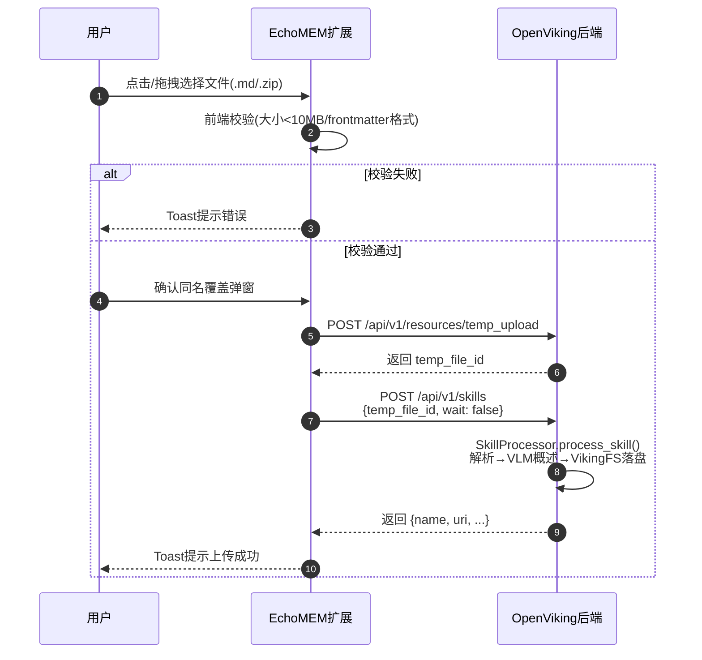

# Skill 上传创建功能 —— 代码实现逻辑文档

> 文档版本：V1（对应 proposals/2026-05-26-skill-upload-creation.md）
> 更新日期：2026-05-27

---

## 一、项目概述

| 项目 | 路径 | 角色 |
|------|------|------|
| EchoMEM Web Extension | `EchoMEM-WEB-EXTENSION/` | Chrome 扩展前端（Manifest V3） |
| OpenViking | `OpenViking/` | AI 资源处理后端 |

**核心目标**：补齐 EchoMEM 扩展「Skill 商店」面板的上传功能，支持用户将本地 `.md` 或 `.zip` 文件上传到 OpenViking 创建 Skill。

---

## 二、时序图



---

## 三、前端修改

### 3.1 修改文件列表

| 文件 | 修改类型 | 说明 |
|------|---------|------|
| `src/services/openviking-client.js` | 新增方法 | 新增 `addSkill()` |
| `src/panels/skill-store/index.js` | 重写上传区域 | 替换占位 UI，实现真实上传交互 |

### 3.2 各文件详细修改

#### `src/services/openviking-client.js`

**新增方法**：`addSkill(options = {})`

```javascript
async addSkill(options = {}) {
  const controller = new AbortController();
  const resourceTimeoutMs = this.cfg.resourceTimeoutMs || 300000;
  const timer = setTimeout(() => controller.abort(), resourceTimeoutMs);

  try {
    const headers = this._buildHeaders();
    const response = await fetch(`${this.cfg.baseUrl}/api/v1/skills`, {
      method: 'POST',
      headers,
      body: JSON.stringify({
        data: options.data || undefined,
        temp_file_id: options.tempFileId || undefined,
        wait: options.wait ?? false,
        timeout: options.timeout || undefined,
      }),
      signal: controller.signal,
    });

    const data = await response.json().catch(() => ({}));
    if (!response.ok || data.status === 'error') {
      throw new Error(data.error?.message || `HTTP ${response.status}`);
    }
    return data.result || data;
  } finally {
    clearTimeout(timer);
  }
}
```

**用途**：封装 `POST /api/v1/skills`，支持通过 `temp_file_id` 创建 Skill。

---

#### `src/panels/skill-store/index.js`（上传区域）

**功能模块**：

1. **文件选择器**
   - `accept=".md,.txt,.zip"`
   - 文案：`支持 .md / .txt（内容须符合 SKILL.md 格式）/ .zip，单个文件不超过 10MB`

2. **拖拽区域**
   - 复用现有视觉骨架，绑定 `dragover`/`dragleave`/`drop` 事件

3. **前端校验**
   - 文件大小 < 10MB
   - `.md`/`.txt` 文件：内容必须以 `---` 开头，frontmatter 中必须包含 `name` 字段
   - `.zip` 文件：不做前端内容校验（由服务端解压后验证）

4. **上传流程**
   - 用户确认覆盖弹窗：通过 `openCenterOverlay` 显示自定义浮层，文案为「如存在同名 Skill「xxx」，将直接覆盖」
   - Step 1: `tempUpload(file)` → `POST /api/v1/resources/temp_upload`
   - Step 2: `addSkill({ tempFileId, wait: false })` → `POST /api/v1/skills`
   - 成功/失败 Toast 提示

**上传须知（UI 中显式展示）**：

| 序号 | 须知内容 |
|------|---------|
| 1 | SKILL.md 必须以 `---` 开头，frontmatter 中必须包含 `name` 字段 |
| 2 | zip 根目录下必须直接包含 SKILL.md，不能套在子文件夹里 |
| 3 | 如存在同名 Skill，将直接覆盖 |
| 4 | 前端校验仅供参考，最终格式以服务端解析为准 |
| 5 | 上传成功后可在「我的 Skill」中查看 |

---

## 四、OpenViking 后端行为（复用现有接口，未修改）

### 4.1 接口清单

| 接口路径 | 方法 | 用途 | 调用位置 |
|---------|------|------|---------|
| `/api/v1/resources/temp_upload` | POST | 临时上传本地文件 | `tempUpload()` |
| `/api/v1/skills` | POST | 创建 Skill | `addSkill()` |

### 4.2 Skill 处理流程（服务端）

```
add_skill() 被调用
    │
    ├── resolve_uploaded_temp_file_id() 解析临时文件路径
    │
    ├── SkillProcessor.process_skill()
    │   ├── _parse_skill()
    │   │   ├── zip → 解压到临时目录
    │   │   ├── 目录 → 查找 SKILL.md
    │   │   ├── 单文件 → SkillLoader.load()
    │   │   └── 字符串 → SkillLoader.parse()
    │   │
    │   ├── SkillLoader.parse() 解析 frontmatter
    │   │   ├── 正则提取 YAML frontmatter + Markdown 正文
    │   │   ├── yaml.safe_load() 解析 frontmatter
    │   │   └── 校验：必须有 name、description 字段
    │   │
    │   ├── _generate_overview() VLM 生成 L1 概述
    │   │
    │   └── _write_skill_content() 写入 VikingFS
    │       ├── SKILL.md（正文，frontmatter 已被提取）
    │       ├── .abstract.md（description）
    │       └── .overview.md（VLM 概述）
    │
    └── 返回 { name, uri, ... }
```

### 4.3 Skill 存储路径

上传成功后，Skill 落盘到：

```
viking://agent/skills/{skill_name}/
├── SKILL.md          ← Markdown 正文（不含 frontmatter）
├── .abstract.md      ← 隐藏文件：description
└── .overview.md      ← 隐藏文件：VLM 生成的概述
```

**注意**：OpenViking 的 `SkillLoader.parse()` 在写入时会将 frontmatter 提取出来，写入 `.abstract.md`，而 `SKILL.md` 中只保留 Markdown 正文。这是前端列表查看时需要适配的关键行为。

---

## 五、整体数据流

```
┌─────────────────────────────────────────────────────────────┐
│                    用户操作（EchoMEM 扩展）                   │
└─────────────────────────────────────────────────────────────┘
    │
    ▼
点击/拖拽选择 .md 或 .zip 文件
    │
    ▼
┌─────────────────────────────────────────────────────────────┐
│  1. 前端校验                                                  │
│     - 文件大小 < 10MB                                        │
│     - .md/.txt 必须以 --- 开头，frontmatter 含 name          │
│     - 确认同名覆盖弹窗                                        │
└─────────────────────────────────────────────────────────────┘
    │
    ▼
┌─────────────────────────────────────────────────────────────┐
│  2. tempUpload(file)                                          │
│     ──POST /api/v1/resources/temp_upload──▶ OpenViking      │
│     返回 temp_file_id                                        │
└─────────────────────────────────────────────────────────────┘
    │
    ▼
┌─────────────────────────────────────────────────────────────┐
│  3. addSkill({ tempFileId, wait: false })                     │
│     ──POST /api/v1/skills──▶ OpenViking                      │
│     返回 { name, uri, ... }                                  │
└─────────────────────────────────────────────────────────────┘
    │
    ▼
┌─────────────────────────────────────────────────────────────┐
│  OpenViking 后端（异步）                                      │
│  ├── SkillProcessor.process_skill()                          │
│  │   ├── SkillLoader.parse() 提取 frontmatter                 │
│  │   ├── VLM 生成 overview                                   │
│  │   └── VikingFS 落盘                                       │
│  └── 返回处理结果                                             │
└─────────────────────────────────────────────────────────────┘
    │
    ▼
前端 Toast 提示上传成功/失败
```

---

## 六、错误处理

| 错误场景 | 提示位置 | 提示文案 |
|---------|---------|---------|
| 文件超过 10MB | 校验失败 Toast | 文件过大，请压缩附件后重试 |
| 缺少 frontmatter | 校验失败 Toast | SKILL.md 必须以 --- 开头 |
| 缺少 name 字段 | 校验失败 Toast | frontmatter 中必须包含 name 字段 |
| 网络/服务端错误 | 上传失败 Toast | 上传失败: {具体错误信息} |
| 请求超时 | 上传失败 Toast | 请求超时，请检查后端是否正常运行或网络连接 |
| 认证失败 | 上传失败 Toast | 认证失败，请在「OpenViking 连接配置」中检查 API Key |

---

## 七、验收标准对应

| 编号 | 验收项 | 实现方式 |
|------|--------|---------|
| 1 | 可选择 `.md` 文件并成功上传 | `accept=".md"` + `tempUpload` + `addSkill` |
| 2 | 可选择 `.zip` 文件并成功上传 | `accept=".zip"` + 服务端自动解压 |
| 3 | 上传成功后自动刷新 Skill 列表 | 点击「我的 Skill」时从 OpenViking 重新加载 |
| 4 | 上传中按钮禁用，防止重复提交 | `validateFile` 校验通过后才进入上传流程 |
| 5 | 成功/失败均有 Toast 提示 | `showStatus()` 统一状态反馈 |
| 6 | 单文件上传前校验 frontmatter 格式 | `validateFile()` 中读取文件内容并解析 frontmatter |
| 7 | 同名 Skill 覆盖行为符合后端逻辑 | 上传前 `openCenterOverlay` 自定义浮层确认，含取消/确认按钮 |
| 8 | 所有前端显式提示均在对应场景正确展示 | 拖拽区域下方 + 上传须知区域 + 校验失败 Toast |

---

## 八、关键设计决策

| 决策 | 说明 |
|------|------|
| `.txt` 保留但加说明 | 后端 `SkillLoader.load()` 不检查扩展名，`.txt` 只要内容格式正确即可处理，但为避免用户误解，文案中明确标注「内容须符合 SKILL.md 格式」 |
| 前端只校验 `.md`/`.txt`，不校验 `.zip` | `.zip` 的内容在前端无法直接读取验证，由服务端解压后处理 |
| `wait: false` 异步上传 | 文件通常较小，但 Skill 处理涉及 VLM 概述生成，使用异步模式避免阻塞 |
| 前端不显示上传进度条 | 文件通常较小（<10MB），loading 状态已足够 |
| `skillCache` 在列表面板中缓存 | 上传成功后进入「我的 Skill」页面时，缓存会触发刷新（点击刷新按钮或重新进入页面） |
