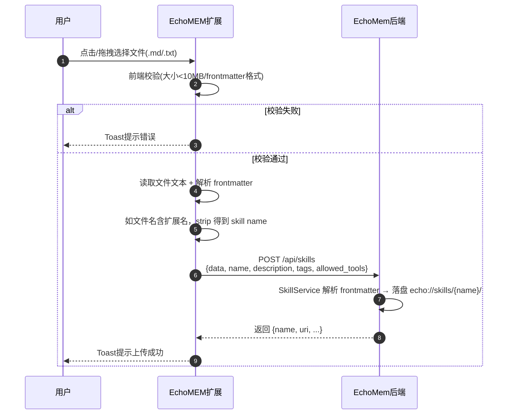

# Skill 上传创建功能 —— 代码实现逻辑文档

> 文档版本：V2（EchoMem 后端迁移 Phase 2）
> 更新日期：2026-06-23

---

## 一、项目概述

| 项目 | 路径 | 角色 |
|------|------|------|
| EchoMEM Web Extension | `EchoMEM-WEB-EXTENSION/` | Chrome 扩展前端（Manifest V3） |
| EchoMem | `EchoMem/` | 记忆后端引擎 |

**核心目标**：将 EchoMEM 扩展「Skill 商店」面板的上传功能从 OpenViking 迁移到 EchoMem，支持用户将本地 `.md` 或 `.txt` 文件上传到 EchoMem 创建 Skill。

---

## 二、时序图



---

## 三、前端修改

### 3.1 修改文件列表

| 文件 | 修改类型 | 说明 |
|------|---------|------|
| `src/services/echomem-client.js` | 新增方法 | 新增 `addSkill()` |
| `src/panels/skill-store/index.js` | 重写上传区域 | 替换 OpenViking 调用为 EchoMem 调用 |

### 3.2 各文件详细修改

#### `src/services/echomem-client.js`

**新增方法**：`addSkill(options = {})`

```javascript
async addSkill(options = {}) {
  const body = {
    data: options.data,
    name: options.name,
    description: options.description,
    tags: options.tags,
    allowed_tools: options.allowedTools,
  };
  Object.keys(body).forEach((key) => {
    if (body[key] === undefined) delete body[key];
  });

  const result = await this._fetchJson(`${this.cfg.baseUrl}/api/skills`, {
    method: 'POST',
    headers: this._buildHeaders(true),
    body: JSON.stringify(body),
  });

  return result;
}
```

**用途**：封装 `POST /api/skills`，直接上传 SKILL.md 文本内容。

---

#### `src/panels/skill-store/index.js`（上传区域）

**功能模块**：

1. **文件选择器**
   - `accept=".md,.txt"`
   - 文案：`支持 .md / .txt（内容须符合 SKILL.md 格式），单个文件不超过 10MB`

2. **拖拽区域**
   - 复用现有视觉骨架，绑定 `dragover`/`dragleave`/`drop` 事件

3. **前端校验**
   - 文件大小 < 10MB
   - `.md`/`.txt` 文件：内容必须以 `---` 开头
   - 前端不对 skill name 做字符规则校验，完全由后端验证并返回错误

4. **上传流程**
   - 用户确认覆盖弹窗：通过 `openCenterOverlay` 显示自定义浮层，文案为「如存在同名 Skill「xxx」，将直接覆盖」
   - Step 1: 读取文件文本 `const text = await file.text()`
   - Step 2: 解析 frontmatter 得到 `name`、`description`、`tags`、`allowed_tools`
   - Step 3: skill name 优先取 frontmatter.name；若 frontmatter 未提供，则从文件名 strip `.md`/`.txt` 扩展名得到
   - Step 4: `addSkill({ data: text, name, description, tags, allowedTools })` → `POST /api/skills`
   - 成功/失败 Toast 提示

**上传须知（UI 中显式展示）**：

| 序号 | 须知内容 |
|------|----------|
| 1 | SKILL.md 必须以 `---` 开头 |
| 2 | Skill 名称优先取 frontmatter 中的 `name`；未填写时取文件名（去掉 `.md` / `.txt`） |
| 3 | Skill 名称仅支持字母、数字、下划线、短横线（正则 `^[\w\-]+$`） |
| 4 | 如存在同名 Skill，将直接覆盖 |
| 5 | 前端校验仅供参考，最终格式以服务端解析为准 |
| 6 | 上传成功后可在「我的 Skill」中查看 |

---

## 四、EchoMem 后端行为

### 4.1 接口清单

| 接口路径 | 方法 | 用途 | 调用位置 |
|---------|------|------|---------|
| `/api/skills` | POST | 创建/更新 Skill | `addSkill()` |

### 4.2 Skill 处理流程（服务端）

```
add_skill() 被调用
    │
    ├── 解析请求体 data（SKILL.md 文本）
    │
    ├── 解析 frontmatter
    │   ├── 必须有 name 字段
    │   └── 提取 description、tags、allowed_tools 等
    │
    ├── 校验 name：^[A-Za-z0-9_\-]{1,64}$
    │
    └── 写入 echo://skills/{name}/
        ├── SKILL.md          ← Markdown 正文（含 frontmatter）
        └── meta.json         ← 元数据（description、tags 等）
    │
    └── 返回 { name, uri, ... }
```

### 4.3 Skill 存储路径

上传成功后，Skill 落盘到：

```
echo://skills/{skill_name}/
├── SKILL.md          ← Markdown 正文（含 frontmatter）
└── meta.json         ← 元数据
```

**注意**：与原 OpenViking 不同，EchoMem 保留 frontmatter 在 SKILL.md 中，前端读取 `/fs/read?uri=echo://skills/{name}/SKILL.md` 即可得到完整内容。

---

## 五、整体数据流

```
┌─────────────────────────────────────────────────────────────┐
│                    用户操作（EchoMEM 扩展）                   │
└─────────────────────────────────────────────────────────────┘
    │
    ▼
点击/拖拽选择 .md 或 .txt 文件
    │
    ▼
┌─────────────────────────────────────────────────────────────┐
│  1. 前端校验                                                  │
│     - 文件大小 < 10MB                                        │
│     - .md/.txt 必须以 --- 开头，frontmatter 含 name          │
│     - 确认同名覆盖弹窗                                        │
└─────────────────────────────────────────────────────────────┘
    │
    ▼
┌─────────────────────────────────────────────────────────────┐
│  2. 读取文件文本并解析 frontmatter                            │
│     - data = await file.text()                               │
│     - { name, description, tags, allowed_tools }             │
│     - name 缺省时从文件名 strip 扩展名                        │
└─────────────────────────────────────────────────────────────┘
    │
    ▼
┌─────────────────────────────────────────────────────────────┐
│  3. addSkill({ data, name, description, tags, allowedTools }) │
│     ──POST /api/skills──▶ EchoMem                            │
│     返回 { name, uri, ... }                                  │
└─────────────────────────────────────────────────────────────┘
    │
    ▼
前端 Toast 提示上传成功/失败
```

---

## 六、错误处理

| 错误场景 | 提示位置 | 提示文案 |
|---------|---------|---------|
| 文件超过 10MB | 校验失败 Toast | 文件过大，请压缩附件后重试 |
| 缺少 frontmatter | 校验失败 Toast | SKILL.md 必须以 --- 开头 |
| 缺少 name 字段 | 校验失败 Toast | frontmatter 中必须包含 name 字段 |
| name 不符合后端规则 | 上传失败 Toast | 上传失败: Skill name must match `^[\w\-]+$` |
| 网络/服务端错误 | 上传失败 Toast | 上传失败: {具体错误信息} |
| 请求超时 | 上传失败 Toast | 请求超时，请检查后端是否正常运行或网络连接 |
| 认证失败 | 上传失败 Toast | 认证失败，请在「记忆后端引擎连接配置」中检查 Auth Key |

---

## 七、验收标准对应

| 编号 | 验收项 | 实现方式 |
|------|--------|---------|
| 1 | 可选择 `.md` 文件并成功上传 | `accept=".md"` + 读取文本 + `addSkill` |
| 2 | 可选择 `.txt` 文件并成功上传 | `accept=".txt"` + 读取文本 + `addSkill` |
| 3 | 上传成功后自动刷新 Skill 列表 | 成功后清空 `skillCache`，下次进入「我的 Skill」时重新加载 |
| 4 | 上传中按钮禁用，防止重复提交 | 上传流程开始后禁用按钮并显示 loading |
| 5 | 成功/失败均有 Toast 提示 | `showStatus()` 统一状态反馈 |
| 6 | 单文件上传前校验 frontmatter 格式 | `validateFile()` 中读取文件内容并解析 frontmatter |
| 7 | 同名 Skill 覆盖行为符合后端逻辑 | 上传前 `openCenterOverlay` 自定义浮层确认，含取消/确认按钮 |
| 8 | 所有前端显式提示均在对应场景正确展示 | 拖拽区域下方 + 上传须知区域 + 校验失败 Toast |

---

## 八、关键设计决策

| 决策 | 说明 |
|------|------|
| `.txt` 保留但加说明 | 后端不检查扩展名，`.txt` 只要内容格式正确即可处理，文案中明确标注「内容须符合 SKILL.md 格式」 |
| 不再支持 `.zip` | EchoMem Skill 服务当前只接受单文件文本，zip 解压由后端负责的能力暂不可用 |
| 前端不校验 name 字符规则 | 后端校验规则 `^[\w\-]+$` 可能调整，前端只确保能提取到非空 skill name（frontmatter 或文件名），错误直接透传后端提示 |
| 文件名作为 name 兜底 | 当 SKILL.md 没写 `name` 时，从 `skill.md` strip 扩展名得到 `skill`；若仍不合规则则让后端报错 |
| `skillCache` 在列表面板中缓存 | 上传成功后进入「我的 Skill」页面时，缓存会触发刷新（点击刷新按钮或重新进入页面） |
