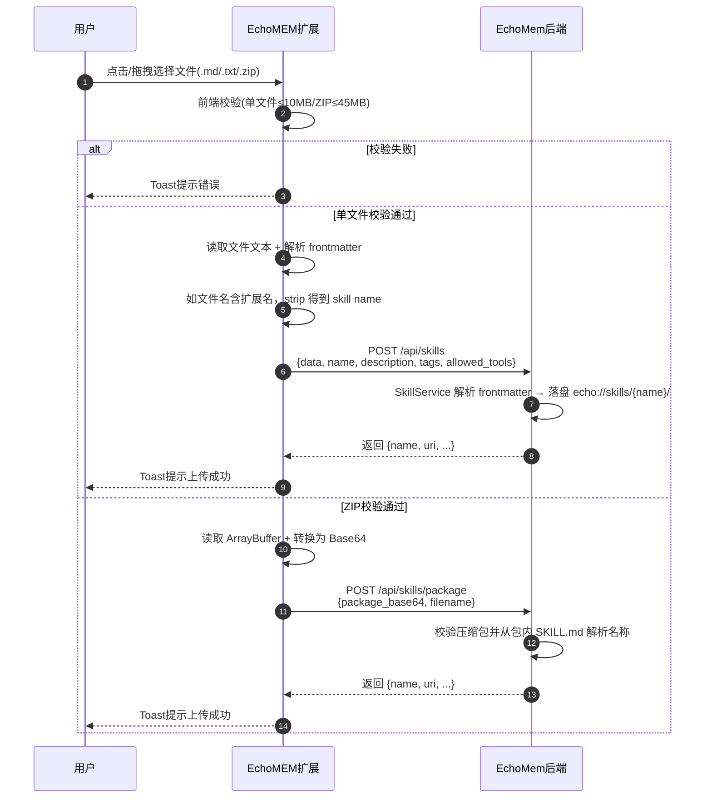

# Skill 上传创建功能 —— 代码实现逻辑文档

> 文档版本：V3（完整 Skill Package 上传）
> 更新日期：2026-08-05

---

## 一、项目概述

| 项目 | 路径 | 角色 |
|------|------|------|
| EchoMEM Web Extension | `EchoMEM-WEB-EXTENSION/` | Chrome 扩展前端（Manifest V3） |
| EchoMem | `EchoMem/` | 记忆后端引擎 |

**核心目标**：支持用户将本地 `.md` / `.txt` 单文件 SKILL.md，或包含配套目录与文件的 `.zip` Skill Package 上传到 EchoMem 创建 Skill。

---

## 二、时序图



---

## 三、前端修改

### 3.1 修改文件列表

| 文件 | 修改类型 | 说明 |
|------|---------|------|
| `src/services/echomem-client.js` | 新增方法 | 提供 `addSkill()` 与 `addSkillPackage()` |
| `src/panels/skill-store/upload.js` | 新增上传辅助模块 | 校验扩展名、大小，规范化名称并转换 Base64 |
| `src/panels/skill-store/index.js` | 扩展上传区域 | 分流单文件与完整 Skill Package 上传 |

### 3.2 各文件详细修改

#### `src/services/echomem-client.js`

**相关方法**：`addSkill(options = {})`、`addSkillPackage(options = {})`

```javascript
async addSkill(options = {}) {
  const body = {
    data: options.data,
    name: options.name,
    description: options.description,
    tags: options.tags,
    allowed_tools: options.allowedTools,
  };
  Object.keys(body).forEach((key) => {
    if (body[key] === undefined) delete body[key];
  });

  const result = await this._fetchJson(`${this.cfg.baseUrl}/api/skills`, {
    method: 'POST',
    headers: this._buildHeaders(true),
    body: JSON.stringify(body),
  });

  return result;
}
```

**用途**：封装 `POST /api/skills`，直接上传 SKILL.md 文本内容。

`addSkillPackage()` 封装 `POST /api/skills/package`，发送 `{ package_base64, filename }`。该方法也支持可选的 `name`、`description`、`tags`、`allowed_tools` 和 `metadata` 字段；当前扩展仅传入压缩包内容与原始文件名，Skill 名称由 EchoMem 从包内 `SKILL.md` 解析。Package 请求默认超时为 120 秒，并可通过 `timeoutMs` 单次覆盖；其他 EchoMem 请求仍使用客户端的常规超时配置。

---

#### `src/panels/skill-store/index.js`（上传区域）

**功能模块**：

1. **文件选择器**
   - `accept=".md,.txt,.zip"`
   - 文案：单文件不超过 10 MB，ZIP 不超过 45 MB

2. **拖拽区域**
   - 复用现有视觉骨架，绑定 `dragover`/`dragleave`/`drop` 事件

3. **前端校验**
   - `.md` / `.txt` 文件大小不超过 10 MB
   - `.zip` 文件大小不超过 45 MB
   - `.md`/`.txt` 文件：内容必须以 `---` 开头
   - `.zip` 文件：前端只校验扩展名和大小，包结构与安全规则交给 EchoMem 校验
   - 前端不对 skill name 做字符规则校验，完全由后端验证并返回错误

4. **上传流程**
   - 单文件：读取文本、解析 frontmatter，并调用 `addSkill(...)` → `POST /api/skills`
   - ZIP Package：读取 `ArrayBuffer`、转换为 Base64，并调用 `addSkillPackage(...)` → `POST /api/skills/package`
   - 用户确认覆盖弹窗：单文件显示解析后的名称；ZIP 提示 EchoMem 将从包内 `SKILL.md` 解析名称
   - 成功/失败 Toast 提示

**上传须知（UI 中显式展示）**：

| 序号 | 须知内容 |
|------|----------|
| 1 | 单文件 SKILL.md 必须以 `---` 开头 |
| 2 | ZIP Package 必须包含 `SKILL.md`，可附带 scripts、assets、templates、references 等目录 |
| 3 | ZIP 中禁止隐藏目录、`.git`、`.skill_evolution`、路径穿越和可执行文件；最终由 EchoMem 服务端校验 |
| 4 | Skill 名称优先取 frontmatter 中的 `name`；单文件未填写时取文件名（去掉扩展名） |
| 5 | Skill 名称仅支持字母、数字、下划线、短横线（正则 `^[\w\-]+$`） |
| 6 | 如存在同名 Skill，将直接覆盖 |
| 7 | 前端校验仅供参考，最终格式以服务端解析为准 |
| 8 | 上传成功后可在「我的 Skill」中查看 |

---

## 四、EchoMem 后端行为

### 4.1 接口清单

| 接口路径 | 方法 | 用途 | 调用位置 |
|---------|------|------|---------|
| `/api/skills` | POST | 创建/更新 Skill | `addSkill()` |
| `/api/skills/package` | POST | 上传完整 Skill Package | `addSkillPackage()` |

### 4.2 Skill 处理流程（服务端）

```
add_skill() 被调用
    │
    ├── 解析请求体 data（SKILL.md 文本）
    │
    ├── 解析 frontmatter
    │   ├── 必须有 name 字段
    │   └── 提取 description、tags、allowed_tools 等
    │
    ├── 校验 name：^[A-Za-z0-9_\-]{1,64}$
    │
    └── 写入 echo://skills/{name}/
        ├── SKILL.md          ← Markdown 正文（含 frontmatter）
        └── meta.json         ← 元数据（description、tags 等）
    │
    └── 返回 { name, uri, ... }
```

### 4.3 Skill 存储路径

上传成功后，Skill 落盘到：

```
echo://skills/{skill_name}/
├── SKILL.md          ← Markdown 正文（含 frontmatter）
└── meta.json         ← 元数据
```

**注意**：与原 OpenViking 不同，EchoMem 保留 frontmatter 在 SKILL.md 中，前端读取 `/fs/read?uri=echo://skills/{name}/SKILL.md` 即可得到完整内容。

---

## 五、整体数据流

```
┌─────────────────────────────────────────────────────────────┐
│                    用户操作（EchoMEM 扩展）                   │
└─────────────────────────────────────────────────────────────┘
    │
    ▼
点击/拖拽选择 .md、.txt 或 .zip 文件
    │
    ▼
┌─────────────────────────────────────────────────────────────┐
│  1. 前端校验                                                  │
│     - .md/.txt ≤ 10 MB；.zip ≤ 45 MB                         │
│     - .md/.txt 必须以 --- 开头                               │
│     - 确认同名覆盖弹窗                                        │
└─────────────────────────────────────────────────────────────┘
    │
    ▼
┌─────────────────────────────────────────────────────────────┐
│  2. 按文件类型处理                                             │
│     - .md/.txt：读取文本并解析 frontmatter                    │
│     - .zip：读取 ArrayBuffer 并转换为 Base64                  │
└─────────────────────────────────────────────────────────────┘
    │
    ▼
┌─────────────────────────────────────────────────────────────┐
│  3. 调用对应接口                                               │
│     - 单文件：POST /api/skills                               │
│     - ZIP：POST /api/skills/package                          │
│     返回 { name, uri, ... }                                  │
└─────────────────────────────────────────────────────────────┘
    │
    ▼
前端 Toast 提示上传成功/失败
```

---

## 六、错误处理

| 错误场景 | 提示位置 | 提示文案 |
|---------|---------|---------|
| 单文件超过 10 MB | 校验失败 Toast | 单文件 Skill 不能超过 10 MB |
| ZIP 超过 45 MB | 校验失败 Toast | Skill Package 不能超过 45 MB |
| 不支持的文件扩展名 | 校验失败 Toast | 当前版本仅支持 .md / .txt / .zip 格式 Skill |
| 缺少 frontmatter | 校验失败 Toast | SKILL.md 必须以 --- 开头 |
| 缺少 name 字段 | 校验失败 Toast | frontmatter 中必须包含 name 字段 |
| ZIP 结构或内容不安全 | 上传失败 Toast | 透传 EchoMem 服务端返回的校验错误 |
| name 不符合后端规则 | 上传失败 Toast | 上传失败: Skill name must match `^[\w\-]+$` |
| 网络/服务端错误 | 上传失败 Toast | 上传失败: {具体错误信息} |
| 请求超时 | 上传失败 Toast | Package 默认等待 120 秒；超时后提示检查后端状态或网络连接 |
| 认证失败 | 上传失败 Toast | 认证失败，请在「记忆后端引擎连接配置」中检查 Auth Key |

---

## 七、验收标准对应

| 编号 | 验收项 | 实现方式 |
|------|--------|---------|
| 1 | 可选择 `.md` 文件并成功上传 | `accept=".md"` + 读取文本 + `addSkill` |
| 2 | 可选择 `.txt` 文件并成功上传 | `accept=".txt"` + 读取文本 + `addSkill` |
| 3 | 可选择 `.zip` 并上传完整 Skill Package | 读取二进制 + Base64 编码 + `addSkillPackage` |
| 4 | 单文件与 ZIP 分别执行 10 MB、45 MB 大小限制 | `validateSkillUploadFile()` |
| 5 | 上传成功后自动刷新 Skill 列表 | 成功后清空 `skillCache`，下次进入「我的 Skill」时重新加载 |
| 6 | 上传中按钮禁用，防止重复提交 | 上传流程开始后禁用按钮并显示 loading |
| 7 | 成功/失败均有 Toast 提示 | `showStatus()` 统一状态反馈 |
| 8 | 单文件上传前校验 frontmatter 格式 | `validateFile()` 中读取文件内容并解析 frontmatter |
| 9 | 同名 Skill 覆盖行为符合后端逻辑 | 上传前 `openCenterOverlay` 自定义浮层确认，含取消/确认按钮 |
| 10 | 所有前端显式提示均在对应场景正确展示 | 拖拽区域下方 + 上传须知区域 + 校验失败 Toast |

---

## 八、关键设计决策

| 决策 | 说明 |
|------|------|
| `.txt` 保留但加说明 | 后端不检查扩展名，`.txt` 只要内容格式正确即可处理，文案中明确标注「内容须符合 SKILL.md 格式」 |
| `.zip` 由 EchoMem 解析 | 扩展只校验扩展名和 45 MB 大小限制；该值确保 Base64 编码后约 60 MiB，为 Chrome 单条扩展消息的 JSON 包装预留空间；Skill 名称、包结构与安全规则由服务端统一处理 |
| Package 使用独立超时 | 上传、解压和安全校验可能明显慢于普通 API；Package 默认 120 秒，普通请求仍保持常规超时 |
| 前端不校验 name 字符规则 | 后端校验规则 `^[\w\-]+$` 可能调整，前端只确保能提取到非空 skill name（frontmatter 或文件名），错误直接透传后端提示 |
| 文件名作为 name 兜底 | 当 SKILL.md 没写 `name` 时，从 `skill.md` strip 扩展名得到 `skill`；若仍不合规则则让后端报错 |
| `skillCache` 在列表面板中缓存 | 上传成功后进入「我的 Skill」页面时，缓存会触发刷新（点击刷新按钮或重新进入页面） |
