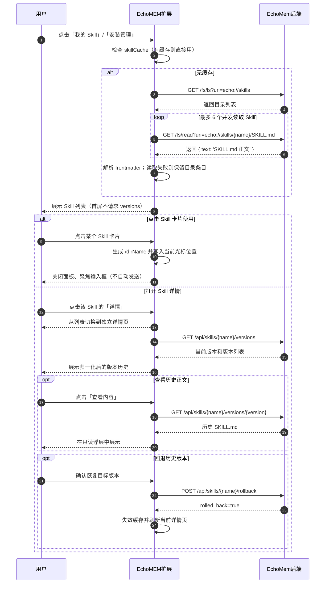

# Skill 列表与详情查看功能 —— 代码实现逻辑文档

> 文档版本：V11（完整 Skill Package 上传）
> 更新日期：2026-08-05
> 版本设计：`docs/flows/skill-store/版本历史与回退设计.md`

---

## 一、项目概述

| 项目 | 路径 | 角色 |
|------|------|------|
| EchoMEM Web Extension | `EchoMEM-WEB-EXTENSION/` | Chrome 扩展前端（Manifest V3） |
| EchoMem | `EchoMem/` | 记忆后端引擎 |

**核心目标**：从 EchoMem 加载 Skill 列表；「我的 Skill」点击卡片后把 `/dirName` 写入当前聊天输入框，独立「详情」按钮按需加载版本历史并支持查看历史正文和确认回退。「安装管理」仍只提供删除。

---

## 二、时序图



---

## 三、前端修改

### 3.1 修改文件列表

| 文件 | 修改类型 | 说明 |
|------|---------|------|
| `src/utils/skill-parser.js` | 沿用 | YAML frontmatter 解析工具 |
| `src/core/content-injector.js` | 扩展能力 | 定位当前平台输入框、使用原生 setter 写入普通文本并触发 `input` |
| `src/core/text-insertion.js` | 新增辅助函数 | 在光标或选区位置安全拼接 `/dirName` 和必要空格 |
| `src/panels/skill-store/index.js` | 列表与版本交互 | 列表、详情、版本懒加载、历史正文和回退刷新 |
| `src/panels/skill-store/skill-list.js` | 列表读取辅助函数 | 有界并发读取正文，失败时保留目录降级卡片 |
| `src/panels/skill-store/version-history.js` | 新增辅助函数 | 版本归一化、标签、来源、错误分类和 HTML 转义 |
| `src/services/echomem-client.js` | 新增方法 | `listSkillVersions`、`readSkillVersion`、`rollbackSkillVersion` |
| `tests/*.test.js` | 新增测试 | 客户端契约和可测辅助函数 |

### 3.2 各文件详细修改

#### `src/utils/skill-parser.js`

沿用现有实现，解析 SKILL.md frontmatter：

```javascript
const FRONTMATTER_PATTERN = /^---\s*\n(.*?)\n---\s*\n(.*)$/s;

export function parseSkillMd(content) {
  const cleanContent = content.replace(/^\uFEFF/, '');
  const match = cleanContent.match(FRONTMATTER_PATTERN);
  if (!match) {
    return { frontmatter: {}, body: cleanContent };
  }
  let frontmatter = {};
  try {
    frontmatter = parseSimpleYaml(match[1]);
  } catch (err) {
    console.warn('Failed to parse skill frontmatter:', err);
  }
  return { frontmatter, body: match[2] };
}

export function getEntryName(entry) {
  if (entry?.name) return entry.name;
  if (entry?.uri) {
    const parts = entry.uri.split('/').filter(Boolean);
    return parts[parts.length - 1] || '未命名';
  }
  return '未命名';
}
```

---

#### `src/panels/skill-store/index.js`（列表区域）

**核心加载函数 `loadSkills()`**：

```javascript
const SKILL_ROOT_URI = 'echo://skills';  // 无尾部斜杠

async function loadSkills({ force = false, preserveExisting = false } = {}) {
  if (!force && skillCache !== null) { /* 使用缓存 */ return; }

  const config = await getEchoMemConfig();
  const client = createClient(config);

  // 1. 列出 Skill 目录
  const lsResult = await client.fsLs(SKILL_ROOT_URI, {
    output: 'agent',
    absLimit: 128,
    showAllHidden: false,
  });
  let entries = Array.isArray(lsResult) ? lsResult : (lsResult?.entries || []);
  entries = entries.filter(e => e.kind === 'directory');

  // 2. 限制并发读取正文；失败时仍返回以目录名为准的降级卡片
  const skills = await readSkillEntries(
    entries,
    uri => client.fsRead(uri),
    { concurrency: 6 }
  );

  // 3. 按更新时间倒序排列
  skills.sort((a, b) => {
    const ta = a.modifiedAt ? new Date(a.modifiedAt).getTime() : 0;
    const tb = b.modifiedAt ? new Date(b.modifiedAt).getTime() : 0;
    return tb - ta;
  });

  skillCache = skills;
  renderSkills(skills);
}
```

**上传流程 `doUpload()`**：

- `.md` / `.txt` 单文件：限制 10 MB，读取文本并解析 frontmatter，再调用 `client.addSkill({ data, name, description, tags, allowedTools })`
- `.zip` Skill Package：限制 50 MB，读取 `ArrayBuffer` 并转换为 Base64，再调用 `client.addSkillPackage({ packageBase64, filename })`
- ZIP 中的 Skill 名称由 EchoMem 从包内 `SKILL.md` 解析；目录结构、路径穿越、隐藏目录和可执行文件等安全规则由服务端统一校验
- 两种上传方式成功后都会清空 `skillCache`，使「我的 Skill」列表在下次读取时刷新

**删除流程**：

- 点击删除 → 通过数值索引取得 Skill 对象 → 确认浮层 → `client.deleteSkill(dirName || name)` → 清空缓存并刷新列表

Skill 卡片显示 frontmatter `name`；版本、回退和删除 API 使用 `dirName || name` 作为稳定资源标识，避免展示名与真实目录名不一致时请求错路径。

「我的 Skill」卡片主点击同样使用 `dirName || name` 生成 `/dirName`。写入发生在当前光标或选区位置，保留已有输入、补齐必要空格、触发冒泡 `input` 事件并聚焦输入框；成功后关闭面板但不自动发送。卡片内的「详情」按钮切换到独立详情页，并在该页面懒加载版本历史。返回列表时保留搜索条件、滚动位置和面板生命周期内的版本缓存。

---

## 四、EchoMem 后端行为

### 4.1 接口清单

| 接口路径 | 方法 | 用途 | 调用位置 |
|---------|------|------|---------|
| `/api/skills` | POST | 创建/注册 Skill | `addSkill()` |
| `/api/skills/package` | POST | 上传完整 Skill Package | `addSkillPackage()` |
| `/api/skills/{name}` | DELETE | 删除 Skill | `deleteSkill()` |
| `/api/skills/{name}/versions` | GET | 按需获取版本历史 | `listSkillVersions()` |
| `/api/skills/{name}/versions/{version}` | GET | 按需读取历史正文 | `readSkillVersion()` |
| `/api/skills/{name}/rollback` | POST | 切换当前版本 | `rollbackSkillVersion()` |
| `/fs/ls` | GET | 列出 Skill 目录下的子目录 | `fsLs()` |
| `/fs/read` | GET | 读取 SKILL.md 正文 | `fsRead()` |

### 4.2 `fs/ls` 返回格式（`output='agent'`）

```javascript
[
  {
    uri: 'echo://skills/test_skill',
    name: 'test_skill',
    kind: 'directory',
    updated_at: '2026-06-22T10:00:00Z',
    abstract: '一个友好的问候助手'
  }
]
```

**注意**：后端使用 `kind: 'directory'/'file'` 标识条目类型，不再使用 `isDir`。

### 4.3 `fs/read` 返回格式

`GET /fs/read?uri=echo://skills/{name}/SKILL.md` 返回：

```javascript
{
  status: 'ok',
  result: {
    uri: 'echo://skills/{name}/SKILL.md',
    text: '---\nname: test_skill\n...'
  }
}
```

`EchoMemClient.fsRead()` 会优先取 `result.text`，兼容 `result.content` 和字符串响应。

### 4.4 Skill 存储结构

```
echo://skills/{skill_name}/
└── SKILL.md          ← Markdown 正文（含 frontmatter）
```

---

## 五、整体数据流

```
┌─────────────────────────────────────────────────────────────┐
│                    用户操作（EchoMEM 扩展）                   │
└─────────────────────────────────────────────────────────────┘
    │
    ▼
点击「我的 Skill」/「安装管理」
    │
    ▼
┌─────────────────────────────────────────────────────────────┐
│  1. 检查 skillCache                                           │
│     - 有缓存：直接渲染                                        │
│     - 无缓存：进入加载流程                                    │
└─────────────────────────────────────────────────────────────┘
    │
    ▼
┌─────────────────────────────────────────────────────────────┐
│  2. fsLs(SKILL_ROOT_URI, {output: 'agent'})                  │
│     ──GET /fs/ls──▶ EchoMem                                  │
│     返回目录列表                                              │
└─────────────────────────────────────────────────────────────┘
    │
    ▼
┌─────────────────────────────────────────────────────────────┐
│  3. 最多 6 个并发读取 Skill 的 SKILL.md                       │
│     ──GET /fs/read──▶ EchoMem                                │
│     返回正文（含 frontmatter）                                │
└─────────────────────────────────────────────────────────────┘
    │
    ▼
┌─────────────────────────────────────────────────────────────┐
│  4. 渲染列表                                                  │
│     - name: frontmatter.name 或从 uri 提取目录名             │
│     - description: frontmatter.description 或 entry.abstract │
│     - 按 modifiedAt 倒序排列                                  │
└─────────────────────────────────────────────────────────────┘
    │
    ▼
用户点击某个 Skill 卡片
    │
    ▼
写入 /dirName → 关闭面板 → 聚焦聊天输入框（不发送）

用户点击「详情」
    │
    ▼
切换到独立详情页（概览 + 简介 + 当前内容 + 版本历史 + 资源路径）
```

---

## 六、UI 交互细节

### 6.1 列表页面布局

- **搜索框**：顶部，支持按名称和描述实时过滤（300ms debounce）
- **刷新按钮**：搜索框右侧，点击清除缓存并重新加载
- **Skill 卡片**：上层使用完整宽度展示名称和描述，下层集中展示版本/时间与「详情」操作，不额外显示重复的「使用」按钮
- **直接使用**：「我的 Skill」点击卡片，或聚焦名称/描述主区域后按 `Enter` / `Space`，将 `/dirName` 插入聊天输入框，关闭面板并聚焦输入框，不自动发送
- **独立详情页**：面板标题固定为「Skill 详情」，长 Skill 名、`/dirName` 与版本元数据集中在概览区；简介、当前内容、版本历史和资源路径分别呈现，减少嵌套边框和重复操作
- **当前内容**：正文预览使用中性只读代码区，「完整内容」入口放在区块标题栏；长内容在区块内滚动，不挤压版本历史
- **版本行**：当前版本使用左侧强调线和唯一「当前」标记；查看、恢复与重试按钮使用统一状态样式
- **返回列表**：详情页使用面板顶部返回按钮回到原列表，保留搜索条件、滚动位置和已加载缓存
- **查看完整内容**：点击后通过 `openCenterOverlay` 打开浮层，展示 SKILL.md 完整原文（含 frontmatter）
- **查看历史内容**：点击具体版本后再请求正文；仅列表正文版本与后端当前版本一致时复用已读取的 `SKILL.md`，否则读取版本 API；浮层使用 `textContent`
- **回退版本**：确认浮层展示 Skill、当前版本和目标版本；仅 `rolled_back === true` 视为成功；成功或刷新失败提示位于列表与详情的共同父层

### 6.2 「我的 Skill」与「安装管理」的区别

| 页面 | 功能差异 |
|------|---------|
| 我的 Skill | 卡片点击直接使用；无删除按钮；独立详情入口支持版本历史、历史正文和回退 |
| 安装管理 | 只保留删除管理，不渲染版本历史 |

---

## 七、错误处理

| 错误场景 | 处理方式 |
|---------|---------|
| 首次 `fsLs` 失败（网络/服务端错误） | 显示加载失败状态；不写入空缓存 |
| 手动刷新时 `fsLs` 失败 | Toast 提示刷新失败，保留刷新前的列表和缓存 |
| 某个 Skill 的 `SKILL.md` 读取失败 | 保留目录条目并标记「正文待重试」，不误判为没有 Skill |
| Skill 目录为空 | 显示空状态提示「暂无 Skill，请先上传」 |
| 当前页面未找到聊天输入框 | 保留 Skill 面板并提示「未找到当前页面的聊天输入框」 |
| 删除成功但列表刷新失败 | 先从本地列表与缓存移除已删除条目，再保留其余旧列表并提示刷新失败 |
| 删除失败 | `openCenterOverlay` 关闭后 Toast 提示错误，恢复按钮状态 |
| 版本列表返回 404/405 | 仅版本区域提示当前后端不支持 |
| 版本请求返回 401/403 | 提示检查 API Key |
| 版本请求超时、网络或普通失败 | 分类显示；可重试场景保留「重试」按钮 |
| 版本内容缺失 | 保留版本记录，禁用查看和回退 |
| 回退失败 | 保留确认浮层，恢复按钮并允许重试 |

---

## 八、性能优化

| 优化点 | 实现方式 |
|--------|---------|
| 有界并行读取 | `readSkillEntries()` 最多同时读取 6 个 `SKILL.md`，避免刷新瞬间放大后端压力 |
| 内存缓存 | `skillCache` 缓存列表和解析结果，切换面板时优先使用 |
| 稳定刷新 | 刷新按钮请求期间禁用；成功后替换缓存，失败时保留旧列表；可疑空结果会复核一次 |
| 过期请求隔离 | `loadGeneration` 保证旧请求晚返回时不能覆盖较新的刷新结果 |
| 搜索节流 | 搜索输入框使用 300ms debounce，避免频繁过滤渲染 |
| 正文完整查看 | 详情面板中保留 `fullContent`，点击「查看完整内容」后通过 `openCenterOverlay` 展示原文 |
| 版本懒加载 | 列表首屏和卡片使用操作都不请求 `/versions`，只在首次打开详情时读取 |
| 版本请求复用 | 面板生命周期内缓存版本列表、正文和进行中请求 |
| 定向失效 | 顶部刷新清空全部版本缓存；删除和回退按 Skill 清除 |

---

## 九、验收标准对应

| 编号 | 验收项 | 实现方式 |
|------|--------|---------|
| 1 | 「我的 Skill」页面能正确展示真实 Skill 列表 | `fsLs` + `fsRead` + `getEntryName` |
| 2 | 列表按更新时间倒序排列 | `Array.prototype.sort` 按 `updated_at` |
| 3 | 每个 Skill 卡片显示名称、描述、更新时间 | `name` 从 frontmatter/uri 提取，`description` 从 frontmatter/abstract 读取 |
| 4 | 点击卡片或使用键盘直接调用 Skill | 鼠标点击卡片，或聚焦卡片主区域后按 `Enter` / `Space`，均将 `/dirName` 写入当前输入框并聚焦，不自动发送 |
| 5 | 搜索框支持实时过滤 | `input` 事件 + 300ms debounce + `filterSkills()` |
| 6 | Skill 目录为空时显示友好空状态 | `renderSkills([])` 渲染空状态 HTML |
| 7 | 列表加载失败时给出明确错误提示 | 首次失败显示错误；刷新失败保留旧列表并显示 Toast |
| 8 | 单个 Skill 读取失败不影响目录存在性 | `readSkillEntries()` 返回降级卡片，不过滤目录条目 |
| 9 | Skill 上传调用 EchoMem 接口 | `addSkill({data, name, description, tags, allowedTools})` |
| 10 | Skill 删除调用 EchoMem 接口 | `deleteSkill(name)` |
| 11 | 列表首屏和卡片使用不增加版本请求 | 点击独立「详情」按钮时才调用 `listSkillVersions()` |
| 12 | 版本数据安全归一化 | 过滤非法版本、去重、倒序并保证当前标记唯一 |
| 13 | 历史正文按需加载并缓存 | `readSkillVersion()` + 面板内正文缓存 |
| 14 | 回退成功后当前内容和标记同步 | `rollbackSkillVersion()` 成功后失效缓存、重载并刷新详情页 |
| 15 | 「安装管理」不出现版本历史 | `showVersionHistory: false` |
| 16 | 详情与主点击不冲突 | 「详情」按钮只进入详情页，卡片主体只执行使用操作 |
