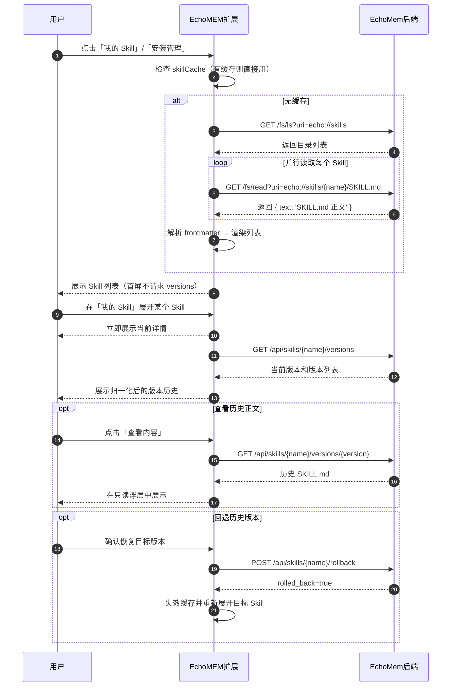

# Skill 列表与详情查看功能 —— 代码实现逻辑文档

> 文档版本：V3（Skill 版本历史与回退）
> 更新日期：2026-07-28
> 版本设计：`docs/flows/skill-store/版本历史与回退设计.md`

---

## 一、项目概述

| 项目 | 路径 | 角色 |
|------|------|------|
| EchoMEM Web Extension | `EchoMEM-WEB-EXTENSION/` | Chrome 扩展前端（Manifest V3） |
| EchoMem | `EchoMem/` | 记忆后端引擎 |

**核心目标**：从 EchoMem 加载 Skill 列表并查看详情；「我的 Skill」在展开后按需加载版本历史，支持查看历史正文和确认回退。「安装管理」仍只提供删除。

---

## 二、时序图



---

## 三、前端修改

### 3.1 修改文件列表

| 文件 | 修改类型 | 说明 |
|------|---------|------|
| `src/utils/skill-parser.js` | 沿用 | YAML frontmatter 解析工具 |
| `src/panels/skill-store/index.js` | 列表与版本交互 | 列表、详情、版本懒加载、历史正文和回退刷新 |
| `src/panels/skill-store/version-history.js` | 新增辅助函数 | 版本归一化、标签、来源、错误分类和 HTML 转义 |
| `src/services/echomem-client.js` | 新增方法 | `listSkillVersions`、`readSkillVersion`、`rollbackSkillVersion` |
| `tests/*.test.js` | 新增测试 | 客户端契约和可测辅助函数 |

### 3.2 各文件详细修改

#### `src/utils/skill-parser.js`

沿用现有实现，解析 SKILL.md frontmatter：

```javascript
const FRONTMATTER_PATTERN = /^---\s*\n(.*?)\n---\s*\n(.*)$/s;

export function parseSkillMd(content) {
  const cleanContent = content.replace(/^\uFEFF/, '');
  const match = cleanContent.match(FRONTMATTER_PATTERN);
  if (!match) {
    return { frontmatter: {}, body: cleanContent };
  }
  let frontmatter = {};
  try {
    frontmatter = parseSimpleYaml(match[1]);
  } catch (err) {
    console.warn('Failed to parse skill frontmatter:', err);
  }
  return { frontmatter, body: match[2] };
}

export function getEntryName(entry) {
  if (entry?.name) return entry.name;
  if (entry?.uri) {
    const parts = entry.uri.split('/').filter(Boolean);
    return parts[parts.length - 1] || '未命名';
  }
  return '未命名';
}
```

---

#### `src/panels/skill-store/index.js`（列表区域）

**核心加载函数 `loadSkills()`**：

```javascript
const SKILL_ROOT_URI = 'echo://skills';  // 无尾部斜杠

async function loadSkills() {
  if (skillCache) { /* 使用缓存 */ return; }

  const config = await getEchoMemConfig();
  const client = createClient(config);

  // 1. 列出 Skill 目录
  const lsResult = await client.fsLs(SKILL_ROOT_URI, {
    output: 'agent',
    absLimit: 128,
    showAllHidden: false,
  });
  let entries = Array.isArray(lsResult) ? lsResult : (lsResult?.entries || []);
  entries = entries.filter(e => e.kind === 'directory');

  // 2. 并行读取每个 Skill 的 SKILL.md
  const skills = await Promise.all(
    entries.map(async (entry) => {
      const dirName = getEntryName(entry);
      const baseUri = entry.uri.replace(/\/$/, '');
      const skillUri = `${baseUri}/SKILL.md`;
      const readResult = await client.fsRead(skillUri);
      const content = typeof readResult === 'string'
        ? readResult
        : (readResult?.text || readResult?.content || '');
      const { frontmatter, body } = parseSkillMd(content);

      return {
        name: frontmatter.name || dirName,
        dirName,
        description: frontmatter.description || entry.abstract || '',
        uri: baseUri,
        rawContent: body,
        fullContent: content,
        modifiedAt: entry.updated_at || entry.modTime || entry.mtime || entry.modifiedAt,
        version: frontmatter.version,
        author: frontmatter.author,
      };
    })
  );

  // 3. 按更新时间倒序排列
  skills.sort((a, b) => {
    const ta = a.modifiedAt ? new Date(a.modifiedAt).getTime() : 0;
    const tb = b.modifiedAt ? new Date(b.modifiedAt).getTime() : 0;
    return tb - ta;
  });

  skillCache = skills;
  renderSkills(skills);
}
```

**上传流程 `executeUpload()`**：

- 校验文件（仅支持 `.md` / `.txt`，zip 暂不处理）
- 读取文件文本 `file.text()`
- 解析 frontmatter 得到 `name`、`description`、`tags`、`allowed_tools`
- 调用 `client.addSkill({ data, name, description, tags, allowedTools })`

**删除流程**：

- 点击删除 → 通过数值索引取得 Skill 对象 → 确认浮层 → `client.deleteSkill(dirName || name)` → 清空缓存并刷新列表

Skill 卡片显示 frontmatter `name`；版本、回退和删除 API 使用 `dirName || name` 作为稳定资源标识，避免展示名与真实目录名不一致时请求错路径。

---

## 四、EchoMem 后端行为

### 4.1 接口清单

| 接口路径 | 方法 | 用途 | 调用位置 |
|---------|------|------|---------|
| `/api/skills` | POST | 创建/注册 Skill | `addSkill()` |
| `/api/skills/{name}` | DELETE | 删除 Skill | `deleteSkill()` |
| `/api/skills/{name}/versions` | GET | 按需获取版本历史 | `listSkillVersions()` |
| `/api/skills/{name}/versions/{version}` | GET | 按需读取历史正文 | `readSkillVersion()` |
| `/api/skills/{name}/rollback` | POST | 切换当前版本 | `rollbackSkillVersion()` |
| `/fs/ls` | GET | 列出 Skill 目录下的子目录 | `fsLs()` |
| `/fs/read` | GET | 读取 SKILL.md 正文 | `fsRead()` |

### 4.2 `fs/ls` 返回格式（`output='agent'`）

```javascript
[
  {
    uri: 'echo://skills/test_skill',
    name: 'test_skill',
    kind: 'directory',
    updated_at: '2026-06-22T10:00:00Z',
    abstract: '一个友好的问候助手'
  }
]
```

**注意**：后端使用 `kind: 'directory'/'file'` 标识条目类型，不再使用 `isDir`。

### 4.3 `fs/read` 返回格式

`GET /fs/read?uri=echo://skills/{name}/SKILL.md` 返回：

```javascript
{
  status: 'ok',
  result: {
    uri: 'echo://skills/{name}/SKILL.md',
    text: '---\nname: test_skill\n...'
  }
}
```

`EchoMemClient.fsRead()` 会优先取 `result.text`，兼容 `result.content` 和字符串响应。

### 4.4 Skill 存储结构

```
echo://skills/{skill_name}/
└── SKILL.md          ← Markdown 正文（含 frontmatter）
```

---

## 五、整体数据流

```
┌─────────────────────────────────────────────────────────────┐
│                    用户操作（EchoMEM 扩展）                   │
└─────────────────────────────────────────────────────────────┘
    │
    ▼
点击「我的 Skill」/「安装管理」
    │
    ▼
┌─────────────────────────────────────────────────────────────┐
│  1. 检查 skillCache                                           │
│     - 有缓存：直接渲染                                        │
│     - 无缓存：进入加载流程                                    │
└─────────────────────────────────────────────────────────────┘
    │
    ▼
┌─────────────────────────────────────────────────────────────┐
│  2. fsLs(SKILL_ROOT_URI, {output: 'agent'})                  │
│     ──GET /fs/ls──▶ EchoMem                                  │
│     返回目录列表                                              │
└─────────────────────────────────────────────────────────────┘
    │
    ▼
┌─────────────────────────────────────────────────────────────┐
│  3. 并行读取每个 Skill 的 SKILL.md                            │
│     ──GET /fs/read──▶ EchoMem                                │
│     返回正文（含 frontmatter）                                │
└─────────────────────────────────────────────────────────────┘
    │
    ▼
┌─────────────────────────────────────────────────────────────┐
│  4. 渲染列表                                                  │
│     - name: frontmatter.name 或从 uri 提取目录名             │
│     - description: frontmatter.description 或 entry.abstract │
│     - 按 modifiedAt 倒序排列                                  │
└─────────────────────────────────────────────────────────────┘
    │
    ▼
用户点击某个 Skill
    │
    ▼
展开详情面板（description + 正文预览 + 查看完整内容按钮 + URI）
```

---

## 六、UI 交互细节

### 6.1 列表页面布局

- **搜索框**：顶部，支持按名称和描述实时过滤（300ms debounce）
- **刷新按钮**：搜索框右侧，点击清除缓存并重新加载
- **Skill 卡片**：纵向排列，显示名称、描述摘要、更新时间
- **展开详情**：点击卡片后展开，显示 `description`、正文预览、「查看完整内容」、URI；「我的 Skill」同时懒加载版本历史
- **查看完整内容**：点击后通过 `openCenterOverlay` 打开浮层，展示 SKILL.md 完整原文（含 frontmatter）
- **查看历史内容**：点击具体版本后再请求正文，当前版本优先复用已读取的 `SKILL.md`；浮层使用 `textContent`
- **回退版本**：确认浮层展示 Skill、当前版本和目标版本；仅 `rolled_back === true` 视为成功

### 6.2 「我的 Skill」与「安装管理」的区别

| 页面 | 功能差异 |
|------|---------|
| 我的 Skill | 无删除按钮；支持版本历史、历史正文和回退 |
| 安装管理 | 只保留删除管理，不渲染版本历史 |

---

## 七、错误处理

| 错误场景 | 处理方式 |
|---------|---------|
| `fsLs` 失败（网络/服务端错误） | Toast 提示「加载 Skill 列表失败」，显示空状态 |
| 某个 Skill 的 `SKILL.md` 读取失败 | 跳过该 Skill，`console.warn` 记录，其余正常展示 |
| Skill 目录为空 | 显示空状态提示「暂无 Skill，请先上传」 |
| 删除失败 | `openCenterOverlay` 关闭后 Toast 提示错误，恢复按钮状态 |
| 版本列表返回 404/405 | 仅版本区域提示当前后端不支持 |
| 版本请求返回 401/403 | 提示检查 API Key |
| 版本请求超时、网络或普通失败 | 分类显示；可重试场景保留「重试」按钮 |
| 版本内容缺失 | 保留版本记录，禁用查看和回退 |
| 回退失败 | 保留确认浮层，恢复按钮并允许重试 |

---

## 八、性能优化

| 优化点 | 实现方式 |
|--------|---------|
| 并行读取 | `Promise.all` 并行读取所有 Skill 的 `SKILL.md` |
| 内存缓存 | `skillCache` 缓存列表和解析结果，切换面板时优先使用 |
| 手动刷新 | 点击「刷新」按钮时清空 `skillCache` 并重新加载 |
| 搜索节流 | 搜索输入框使用 300ms debounce，避免频繁过滤渲染 |
| 正文完整查看 | 详情面板中保留 `fullContent`，点击「查看完整内容」后通过 `openCenterOverlay` 展示原文 |
| 版本懒加载 | 列表首屏不请求 `/versions`，只在首次展开时读取 |
| 版本请求复用 | 面板生命周期内缓存版本列表、正文和进行中请求 |
| 定向失效 | 顶部刷新清空全部版本缓存；删除和回退按 Skill 清除 |

---

## 九、验收标准对应

| 编号 | 验收项 | 实现方式 |
|------|--------|---------|
| 1 | 「我的 Skill」页面能正确展示真实 Skill 列表 | `fsLs` + `fsRead` + `getEntryName` |
| 2 | 列表按更新时间倒序排列 | `Array.prototype.sort` 按 `updated_at` |
| 3 | 每个 Skill 卡片显示名称、描述、更新时间 | `name` 从 frontmatter/uri 提取，`description` 从 frontmatter/abstract 读取 |
| 4 | 点击 Skill 展开详情面板，可查看完整内容 | 点击事件切换展开状态；「查看完整内容」按钮通过 `openCenterOverlay` 展示原文 |
| 5 | 搜索框支持实时过滤 | `input` 事件 + 300ms debounce + `filterSkills()` |
| 6 | Skill 目录为空时显示友好空状态 | `renderSkills([])` 渲染空状态 HTML |
| 7 | 列表加载失败时给出明确错误提示 | `try/catch` + Toast + 错误状态 HTML |
| 8 | 单个 Skill 读取失败不影响其他 Skill | `Promise.all` + 单个 `catch` 返回 `error: true` 后过滤 |
| 9 | Skill 上传调用 EchoMem 接口 | `addSkill({data, name, description, tags, allowedTools})` |
| 10 | Skill 删除调用 EchoMem 接口 | `deleteSkill(name)` |
| 11 | 列表首屏不增加版本请求 | 展开 Skill 时才调用 `listSkillVersions()` |
| 12 | 版本数据安全归一化 | 过滤非法版本、去重、倒序并保证当前标记唯一 |
| 13 | 历史正文按需加载并缓存 | `readSkillVersion()` + 面板内正文缓存 |
| 14 | 回退成功后当前内容和标记同步 | `rollbackSkillVersion()` 成功后失效缓存、重载并重新展开 |
| 15 | 「安装管理」不出现版本历史 | `showVersionHistory: false` |
