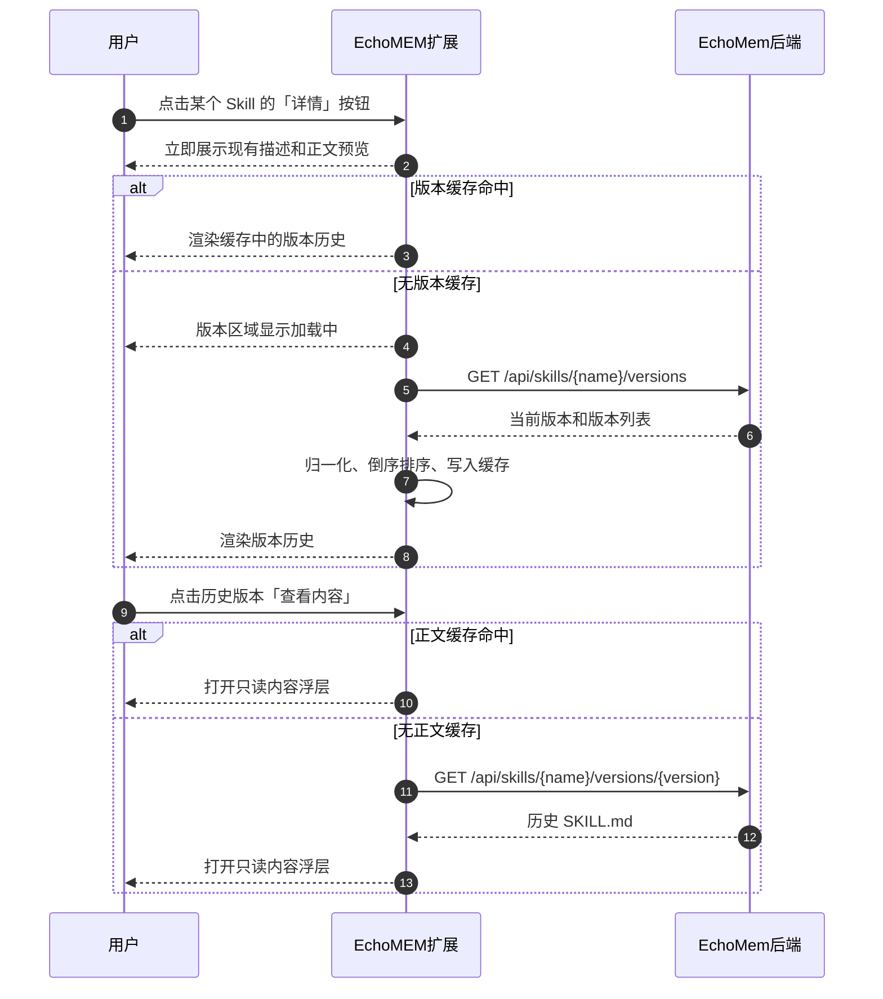

# Skill 版本历史与回退 —— Extension 设计方案

> 状态：Implemented
> 文档版本：V2
> 更新日期：2026-07-29
> 相关 Issue：[`tech-innovation-group/EchoMEM-WEB-EXTENSION#1`](https://github.com/tech-innovation-group/EchoMEM-WEB-EXTENSION/issues/1)
> 相关代码：`src/services/echomem-client.js`、`src/panels/skill-store/index.js`、`src/panels/skill-store/version-history.js`、`src/core/content-injector.js`、`src/core/text-insertion.js`
> 现有流程：`docs/flows/skill-store/列表读取流程.md`

---

## 一、背景与结论

「我的 Skill」页面已经能够读取 `echo://skills`，展示 Skill 名称、描述、frontmatter 版本号、目录更新时间和当前 `SKILL.md` 内容。本次实现在此基础上接入 EchoMem 已有的版本历史与回退接口。

本次只实现 **EchoMEM Web Extension 侧**的改造：复用现有后端接口，在「我的 Skill」详情中按需加载版本历史、查看历史内容并发起版本回退。实现不修改 EchoMem 的版本存储、回退审计或自进化任务模型。

设计结论：

1. 列表阶段继续使用现有 `fsLs + fsRead` 数据，不为每个 Skill 额外请求版本接口。
2. 点击 Skill 卡片直接将 `/dirName` 写入聊天输入框；用户首次点击独立「详情」按钮时，才懒加载该 Skill 的版本历史。
3. 历史版本正文仅在用户点击「查看内容」时读取。
4. 回退成功后同时失效 Skill 列表缓存、版本缓存和历史正文缓存，并重新加载当前 Skill。
5. 旧版 EchoMem 不支持版本接口时，版本区域独立降级，不影响现有列表、上传和删除功能。

---

## 二、目标与非目标

### 2.1 P0 目标

- 在「我的 Skill」详情中显示当前版本和历史版本列表。
- 展示版本号、创建时间、来源、父版本和当前版本标记。
- 支持按需查看某个历史版本的完整 `SKILL.md`。
- 支持用户确认后将历史版本恢复为当前版本。
- 回退成功后刷新当前内容、列表版本信息和历史版本状态。
- 对缺字段、历史文件缺失、旧后端不支持、认证失败和网络失败分别降级。
- 不增加 Skill 列表首屏的版本接口请求量。

### 2.2 非目标

以下内容不属于本次 Extension 设计范围：

- 新增或修改 EchoMem HTTP API。
- 展示最近一次自进化任务的 `running`、`failed`、`no_improvement` 或分数变化。
- 修改回退语义，例如“回退时创建一个新的不可变版本”。
- 增加后端乐观锁、幂等键或自进化任务并发保护。
- 修复后端缺失的 `manual_upload` 来源或权威版本更新时间。
- P0 中实现版本内容 diff；该能力保留为后续增强项。
- 在「安装管理」页面展示版本历史；该页面继续只负责已安装 Skill 的删除管理。

---

## 三、现状与依赖

### 3.1 Extension 现状

| 能力 | 当前实现 |
|------|----------|
| Skill 列表 | `GET /fs/ls?uri=echo://skills` |
| 当前内容 | `GET /fs/read?uri=echo://skills/{name}/SKILL.md` |
| 当前版本 | 解析 `SKILL.md` frontmatter 的 `version` |
| 更新时间 | 使用 Skill 目录条目的 `updated_at` 等兼容字段 |
| 当前详情 | 描述、正文预览、完整内容和 URI |
| Skill 使用 | 点击「我的 Skill」卡片将 `/dirName` 写入聊天输入框，不自动发送 |
| 版本历史 | 已在「我的 Skill」打开详情时懒加载 |
| 历史内容 | 已按版本点击加载并在只读浮层展示 |
| 回退 | 已接入确认、提交、失败重试和成功刷新 |

现有列表在加载时已经为每个 Skill 读取完整 `SKILL.md`。本方案不在该阶段追加版本历史请求，避免从现有 `1 + N` 请求扩大为 `1 + 2N`。

### 3.2 已存在的 EchoMem 接口

本方案依赖以下既有接口：

| 方法 | 路径 | 用途 |
|------|------|------|
| `GET` | `/api/skills/{name}/versions` | 获取当前版本和版本历史 |
| `GET` | `/api/skills/{name}/versions/{version}` | 获取指定版本的完整内容 |
| `POST` | `/api/skills/{name}/rollback` | 将指定历史版本恢复为当前版本 |

所有接口沿用 `EchoMemClient` 的 `X-Auth-Key` 请求头；API `name` 优先使用 `fsLs` 返回的真实目录名 `dirName`，仅在缺失时回退到 frontmatter 展示名，并使用 `encodeURIComponent()` 编码。用户和租户身份由后端从认证信息推导，Extension 不在请求体中传递 `user_id` 或 `tenant_id`。

---

## 四、接口契约与前端模型

### 4.1 获取版本历史

请求：

```http
GET /api/skills/{name}/versions
```

Extension 消费的响应结构：

```json
{
  "name": "example-skill",
  "uri": "echo://skills/example-skill",
  "skill_md_uri": "echo://skills/example-skill/SKILL.md",
  "current_version": 3,
  "versions": [
    {
      "version": 1,
      "parent_version": null,
      "path": ".skill_evolution/versions/v0001.SKILL.md",
      "source": "generated",
      "run_id": "run-1",
      "created_at": "2026-07-01T10:00:00Z",
      "current": false,
      "hash": "sha256...",
      "exists": true
    },
    {
      "version": 3,
      "parent_version": 2,
      "path": ".skill_evolution/versions/v0003.SKILL.md",
      "source": "optimized",
      "run_id": "run-3",
      "created_at": "2026-07-03T10:00:00Z",
      "current": true,
      "hash": "sha256...",
      "exists": true
    }
  ]
}
```

前端归一化模型：

```javascript
{
  name: string,
  currentVersion: number | null,
  versions: Array<{
    version: number,
    parentVersion: number | null,
    source: string,
    runId: string,
    createdAt: string,
    current: boolean,
    hash: string,
    exists: boolean,
  }>,
}
```

归一化规则：

- `currentVersion` 优先取 `current_version`，缺失时取 `current === true` 的版本。
- 无法转换为正整数的 `version` 条目不渲染。
- 版本列表按 `version` 倒序展示，不依赖后端返回顺序。
- `source`、`created_at`、`run_id` 缺失时显示 `—`，不由前端猜测。
- `exists === false` 时保留版本记录，但禁用查看内容和回退按钮。

### 4.2 获取历史版本内容

请求：

```http
GET /api/skills/{name}/versions/{version}
```

Extension 消费的响应结构：

```json
{
  "name": "example-skill",
  "uri": "echo://skills/example-skill",
  "version": 1,
  "current": false,
  "path": ".skill_evolution/versions/v0001.SKILL.md",
  "hash": "sha256...",
  "text": "---\nname: example-skill\nversion: 1\n---\n..."
}
```

`text` 只用于只读浮层展示。渲染时必须进行 HTML 转义，不能将 Markdown 当作 HTML 注入页面。

### 4.3 回退历史版本

请求：

```http
POST /api/skills/{name}/rollback
Content-Type: application/json

{
  "version": 1
}
```

Extension 消费的响应结构：

```json
{
  "name": "example-skill",
  "uri": "echo://skills/example-skill",
  "skill_md_uri": "echo://skills/example-skill/SKILL.md",
  "version": 1,
  "rolled_back": true,
  "hash": "sha256...",
  "git": {
    "enabled": true,
    "status": "committed"
  }
}
```

前端只以 `rolled_back === true` 作为业务成功信号。`git` 是后端审计层的附加结果，不影响 Extension 的成功判断，也不在 P0 UI 中展示。

### 4.4 `EchoMemClient` 新增方法

```javascript
async listSkillVersions(name) {
  if (!name) throw new Error('name is required');
  return this._fetchJson(
    `${this.cfg.baseUrl}/api/skills/${encodeURIComponent(name)}/versions`,
    {
      method: 'GET',
      headers: this._buildHeaders(false),
    }
  );
}

async readSkillVersion(name, version) {
  if (!name) throw new Error('name is required');
  if (!Number.isInteger(version) || version <= 0) {
    throw new Error('version must be a positive integer');
  }
  return this._fetchJson(
    `${this.cfg.baseUrl}/api/skills/${encodeURIComponent(name)}/versions/${version}`,
    {
      method: 'GET',
      headers: this._buildHeaders(false),
    }
  );
}

async rollbackSkillVersion(name, version) {
  if (!name) throw new Error('name is required');
  if (!Number.isInteger(version) || version <= 0) {
    throw new Error('version must be a positive integer');
  }
  return this._fetchJson(
    `${this.cfg.baseUrl}/api/skills/${encodeURIComponent(name)}/rollback`,
    {
      method: 'POST',
      headers: this._buildHeaders(true),
      body: JSON.stringify({ version }),
    }
  );
}
```

---

## 五、页面与交互设计

### 5.1 展示范围

版本区域只在 `initSkillHistoryPanel()` 初始化的「我的 Skill」页面启用：

```javascript
initSkillListPanel(bodyElement, {
  showDelete: false,
  showVersionHistory: true,
  useOnCardClick: true,
});
```

「安装管理」继续使用：

```javascript
initSkillListPanel(bodyElement, {
  showDelete: true,
  showVersionHistory: false,
});
```

这样可以保持两个入口职责清晰，并避免版本回退按钮与删除按钮在同一卡片中竞争操作层级。「我的 Skill」卡片主体只负责使用 Skill，卡片内独立「详情」按钮负责进入详情页和触发版本历史懒加载。

### 5.2 详情布局

点击独立「详情」按钮后，列表页切换为详情页，按以下顺序展示：

```text
描述
当前 SKILL.md 正文预览
查看完整内容
版本历史
URI
```

版本历史区域示意：

```text
版本历史

[当前] v3  自动优化  2026-07-03
       基于 v2 · run-3
       [查看内容]

       v2  自动优化  2026-07-02
       基于 v1 · run-2
       [查看内容] [恢复为此版本]

       v1  自动生成  2026-07-01
       [查看内容] [恢复为此版本]
```

来源映射：

| 后端值 | UI 文案 |
|--------|---------|
| `manual_upload` | 手动上传 |
| `generated` | 自动生成 |
| `optimized` | 自动优化 |
| `rollback` | 历史恢复 |
| `current` | 当前文件 |
| 其他或空值 | 未知来源 |

当前版本只显示「当前」标记和「查看内容」，不显示回退按钮。

### 5.3 懒加载时序



同一 Skill 重复打开详情时不重复请求版本列表；点击卡片使用 Skill 不读取版本接口。只有手动刷新、上传覆盖、删除或回退成功时才失效相关缓存。

### 5.4 回退交互

用户点击「恢复为此版本」后，使用 `openCenterOverlay()` 展示确认浮层：

```text
确认恢复 Skill

将 Skill「example-skill」从当前 v3 恢复为 v1。
恢复后，当前 SKILL.md 会切换到该历史内容。

[取消] [确认恢复]
```

交互规则：

1. 确认按钮点击后立即禁用并显示「恢复中...」，阻止当前页面重复提交。
2. 请求成功前不关闭确认浮层；失败时保留浮层并允许用户重试或取消。
3. 只有响应中 `rolled_back === true` 才视为成功。
4. 成功后关闭浮层，显示成功 Toast，并执行缓存失效与刷新。
5. Extension 不承诺跨页面或跨客户端的并发安全；后端并发控制属于本方案非目标。

回退成功后的刷新顺序：

```text
删除该 Skill 的版本列表缓存
删除该 Skill 的历史正文缓存
清空 skillCache
重新执行 loadSkills()
刷新刚刚操作的 Skill 详情页
重新请求版本历史
```

刷新完成后，列表版本号、正文预览、完整内容和版本历史的「当前」标记必须一致。

---

## 六、状态与缓存设计

### 6.1 状态结构

全局 `skillCache` 继续用于复用 Skill 列表。版本列表、正文和请求中缓存位于 `initSkillListPanel()` 面板生命周期内：

```javascript
let skillCache = null;
const skillVersionCache = new Map();
const skillVersionContentCache = new Map();
const skillVersionRequests = new Map();
const skillVersionContentRequests = new Map();
const rollbackInFlight = new Set();
let expandedSkillKey = null;
let isDetailPageOpen = false;
```

缓存 key：

| 缓存 | key |
|------|-----|
| `skillVersionCache` | `apiName = dirName || name` |
| `skillVersionContentCache` | 一级 `apiName`，二级 `version` |
| `skillVersionRequests` | `apiName` |
| `skillVersionContentRequests` | 一级 `apiName`，二级 `version` |
| `rollbackInFlight` | `apiName` |

### 6.2 缓存失效规则

| 事件 | `skillCache` | 版本列表缓存 | 历史正文缓存 |
|------|--------------|--------------|--------------|
| 进入详情/返回列表 | 保留 | 保留 | 保留 |
| 顶部手动刷新 | 清空 | 全部清空 | 全部清空 |
| 上传成功 | 清空 | 清除同名 Skill | 清除同名 Skill |
| 删除成功 | 清空 | 清除已删除 Skill | 清除已删除 Skill |
| 回退成功 | 清空 | 清除目标 Skill | 清除目标 Skill |
| 单次加载失败 | 保留 | 不缓存失败 | 不缓存失败 |

请求失败不能写入成功缓存，用户点击「重试」时必须重新请求。

---

## 七、兼容与错误处理

### 7.1 状态区分

| 场景 | UI 行为 |
|------|---------|
| 版本接口返回正常且有历史 | 展示版本列表 |
| 版本接口返回正常但只有当前版本 | 展示当前版本，不显示回退按钮 |
| 版本接口返回空列表 | 显示「暂无版本历史」 |
| 后端返回 `404` / `405` | 显示「当前 EchoMem 版本暂不支持版本管理」 |
| 认证失败 `401` / `403` | 显示认证错误，并提示检查 API Key |
| 网络失败或超时 | 显示加载失败和「重试」按钮 |
| 单个版本 `exists === false` | 保留记录，标记「内容缺失」，禁用查看和回退 |
| 历史正文读取失败 | 内容浮层显示错误，不影响版本列表 |
| 回退失败 | 保留当前页面状态，恢复确认按钮并显示具体错误 |

“旧后端不支持”“请求失败”“没有历史”“字段为空”必须作为四种不同状态处理，不能统一显示为“暂无历史”。

### 7.2 安全要求

- Skill 名称、来源、run ID、时间和服务端错误文本在插入 HTML 前统一转义。
- 历史 `SKILL.md` 使用 `textContent` 或完整 HTML 转义后展示。
- 新增按钮只保存数值型 `data-version`；Skill 对象通过当前卡片索引或闭包获取，避免把未转义名称写入属性。
- 请求路径、缓存、请求去重、回退中状态和详情刷新都使用 `apiName`；卡片、Toast 和确认文案仍使用 frontmatter 展示名。
- 客户端继续使用 `encodeURIComponent(name)` 构造 URL。
- 回退按钮在本地请求期间禁用，但不得宣称该机制提供后端并发安全。

---

## 八、代码改造范围

| 文件 | 修改内容 |
|------|----------|
| `src/services/echomem-client.js` | 新增版本列表、版本读取和回退三个客户端方法 |
| `src/panels/skill-store/index.js` | 增加 `showVersionHistory` 选项、版本区域、缓存、事件绑定和回退刷新逻辑 |
| `src/panels/skill-store/version-history.js` | 提取版本归一化、标签、来源、错误分类和 HTML 转义函数 |
| `tests/echomem-client.test.js` | 覆盖 URL 编码、参数校验、回退请求体和错误传播 |
| `tests/skill-version-history.test.js` | 覆盖版本归一化、展示映射、错误分类和 HTML 转义 |
| `package.json` | 声明 ESM 并新增 Node 内置测试脚本 |
| `docs/flows/skill-store/列表读取流程.md` | 补充版本懒加载、历史正文和回退流程 |
| `docs/reference/外部接口清单.md` | 登记三条已调用接口 |
| `README.md`、`docs/README.md` | 同步功能说明和文档索引 |

P0 不新增路由、面板注册或后端代码，也不修改 `background.js`；现有 `echoMemRequest` 代理已经支持 GET 和 JSON POST 请求。

---

## 九、验收标准

| 编号 | 验收项 |
|------|--------|
| 1 | 「我的 Skill」现有列表和搜索保持可用；点击卡片将 `/dirName` 写入输入框且不自动发送 |
| 2 | 首次点击「详情」时才请求 `/api/skills/{name}/versions`，列表首屏和卡片使用均不增加版本请求 |
| 3 | 版本历史按版本号倒序展示，当前版本标记正确 |
| 4 | 版本号、创建时间、来源和父版本缺失时可以安全降级 |
| 5 | 用户可以按需查看任意 `exists === true` 的历史版本完整内容 |
| 6 | 非当前且 `exists === true` 的版本显示「恢复为此版本」按钮 |
| 7 | 回退前显示目标 Skill、当前版本和目标版本确认信息 |
| 8 | 回退请求期间按钮禁用，避免当前页面重复提交 |
| 9 | 回退成功后列表版本号、当前正文和历史当前标记同步刷新 |
| 10 | 回退失败不修改本地展示状态，并允许用户重试 |
| 11 | 旧后端不支持、无历史、字段为空和网络失败显示不同状态 |
| 12 | 「安装管理」的删除功能不受影响，且不出现版本历史区域 |
| 13 | 所有新增服务端文本经过安全转义 |
| 14 | 「详情」按钮进入独立详情页，承载完整内容、版本历史和回退，不与卡片使用操作冲突 |

---

## 十、验证计划

### 10.1 静态验证

```bash
npm test
npm run check
git diff --check
```

确认 Node 单元测试通过，内容脚本能够正常打包，`dist/content.js` 和 `background.js` 通过语法检查，且 diff 无空白错误。

### 10.2 手动验证矩阵

| 场景 | 预期结果 |
|------|----------|
| 有 v1/v2/v3 的 Skill | 展示三条记录，当前版本标记唯一 |
| 点击 Skill 卡片 | 输入框在当前光标位置出现 `/dirName `，面板关闭且不自动发送 |
| 点击「详情」 | 切换到独立详情页并懒加载版本历史，不写入聊天输入框 |
| 详情页返回 | 回到原列表位置，保留搜索条件、滚动位置和版本缓存 |
| 只有当前版本的 Skill | 只展示当前版本，不显示回退按钮 |
| 历史条目 `exists=false` | 显示内容缺失，操作按钮禁用 |
| 查看历史内容 | 浮层显示对应版本完整 `SKILL.md` |
| 从 v3 回退到 v1 | 确认后刷新，列表和详情均显示 v1 为当前版本 |
| 回退请求失败 | 当前内容不变，用户可以重试 |
| API Key 无效 | 版本区域提示认证失败，现有 Skill 基础详情仍可见 |
| 旧后端返回 404/405 | 显示不支持提示，现有列表、上传、删除不受影响 |
| 连续打开同一 Skill 详情 | 缓存命中，不重复请求版本列表 |
| 点击顶部刷新 | 当前 Skill 和版本历史均重新请求 |

### 10.3 网络请求检查

使用 Chrome DevTools 确认：

- 列表初次加载没有调用 `/versions`。
- 点击卡片使用 Skill 不请求版本接口。
- 打开一个 Skill 的详情只新增一次版本列表请求。
- 查看历史内容时只请求选中的版本。
- 回退成功后只刷新必要的 Skill 数据，不为所有 Skill 读取版本历史。

---

## 十一、后续项

下列能力需要单独设计或后端配合，不阻塞本方案实施：

1. 最近一次自进化任务摘要与运行历史。
2. 回退创建新版本或提供用户可查询的 rollback event。
3. `expected_current_version` 乐观并发控制和服务端幂等键。
4. 手动上传 Skill 的来源和权威版本时间补齐。
5. 历史版本内容 diff。
6. 聚合 Skill 摘要接口，以进一步减少列表阶段的完整文件读取。
